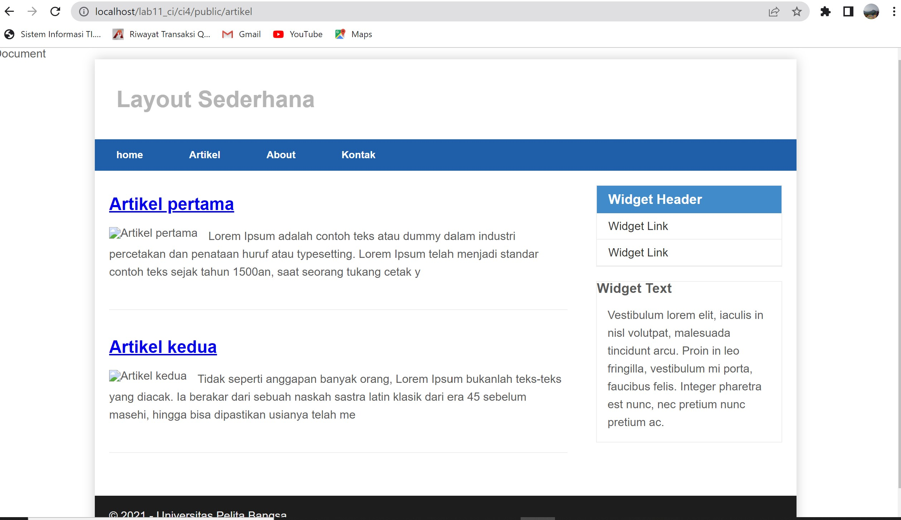

# Pemograman Web

# Praktikum 11: PHP Framework (Codeigniter)
~~~
Nama    : Miftahu Rizkiyah
NIM     : 312010014
KELAS   : TI.20.B1
~~~
# AKTIVASI EKSTENSION
Untuk mengaktifkan ekstentsi tersebut, melalu XAMPP Control Panel, pada bagian<br>
Apache klik Config -> PHP.ini


Pada bagian extention, hilangkan tanda ; (titik koma) pada ekstensi yang akan<br>
diaktifkan. Kemudian simpan kembali filenya dan restart Apache web server.

# Instalasi Codeigniter 4
Untuk melakukan instalasi Codeigniter 4 dapat dilakukan dengan dua cara, yaitu cara<br>
manual dan menggunakan composer. Pada praktikum ini kita menggunakan cara manual.<br>
• Unduh Codeigniter dari website https://codeigniter.com/download<br>
• Extrak file zip Codeigniter ke direktori htdocs/lab11_ci.<br>
• Ubah nama direktory framework-4.x.xx menjadi ci4.<br>

• Buka browser dengan alamat http://localhost/lab11_ci/ci4/public/<br>


# Menjalankan CLI (Command Line Interface)
Codeigniter 4 menyediakan CLI untuk mempermudah proses development. Untuk <br>
mengakses CLI buka terminal/command prompt.<br>
<br>
Arahkan lokasi direktori sesuai dengan direktori kerja project dibuat<br>
(xampp/htdocs/lab11_ci/ci4/)<br>
lalu masukan perintah php spark<br>


# Mengaktifkan Mode Debugging
Ubah nama file env menjadi .env kemudian buka file tersebut dan ubah nilai variable<br>
CI_ENVIRINMENT menjadi development.<br>
<br>

# Membuat Route Baru
Tambahkan kode berikut di dalam Routes.php<br>
```
$routes->get('/about', 'Page::about');
$routes->get('/contact', 'Page::contact');
$routes->get('/faqs', 'Page::faqs');
```
<br>
Untuk mengetahui route yang ditambahkan sudah benar, buka CLI dan jalankan<br>
perintah ```php spark routes```<br>
<br>

# Membuat Controller
Buat file baru dengan nama page.php<br>
pada direktori Controller kemudian isi kodenya seperti berikut.<br>
```
<?php
namespace App\Controllers;
class Page extends BaseController
{
public function about()
{
echo "Ini halaman About";
}
public function contact()
{
echo "Ini halaman Contact";
}
public function faqs()
{
echo "Ini halaman FAQ";
}
}
```
refresh kembali dan hasil akan berubah<br>
<br>

# Membuat View
Buat file
baru dengan nama about.php pada direktori view (app/view/about.php) kemudian isi
kodenya seperti berikut.
```
<!DOCTYPE html>
<html lang="en">
<head>
 <meta charset="UTF-8">
 <title><?= $title; ?></title>
</head>
<body>
 <h1><?= $title; ?></h1>
 <hr>
 <p><?= $content; ?></p>
</body>
</html>
```
Ubah method about pada class Controller Page menjadi seperti berikut:<br>
```
public function about()
{
 return view('about', [
 'title' => 'Halaman Abot',
 'content' => 'Ini adalah halaman abaut yang menjelaskan tentang isi 
halaman ini.'
 ]);
}
```
Lalu refresh<br>
<br>

# Membuat Layout Web dengan CSS
pada direktori public dengan nama style.css copy file dari praktikum <br>
lab4_layout. Kita akan gunakan layout yang pernah dibuat pada praktikum 4.<br>
buat folder template pada direktori view kemudian buat file header.php dan 
footer.php<br>
```
<!DOCTYPE html>
<html lang="en">
<head>
 <meta charset="UTF-8">
 <title><?= $title; ?></title>
 <link rel="stylesheet" href="<?= base_url('/style.css');?>">
</head>
<body>
 <div id="container">
 <header>
 <h1>Layout Sederhana</h1>
 </header>
 <nav>
 <a href="<?= base_url('/');?>" class="active">Home</a>
 <a href="<?= base_url('/artikel');?>">Artikel</a>
 <a href="<?= base_url('/about');?>">About</a>
 <a href="<?= base_url('/contact');?>">Kontak</a>
 </nav>
 <section id="wrapper">
 <section id="main">
```
File app/view/template/footer.php<br>
```
        </section>
            <aside id="sidebar">
                <div class="widget-box">
                    <h3 class="title">Widget Header</h3>
                    <ul>
                        <li><a href="#">Widget Link</a></li>
                        <li><a href="#">Widget Link</a></li>
                    </ul>
                </div>
                <div class="widget-box">
                    <h3 class="title">Widget Text</h3>
                    <p>Vestibulum lorem elit, iaculis in nisl volutpat, malesuada 
                    tincidunt arcu. Proin in leo fringilla, vestibulum mi porta, faucibus felis. 
                    Integer pharetra est nunc, nec pretium nunc pretium ac.</p>
                    </div>
            </aside>
        </section>
    <footer>
    <p>&copy; 2021 - Universitas Pelita Bangsa</p>
    </footer>
 </div>
</body>
</html>
```
Kemudian ubah file app/view/about.php seperti berikut.<br>
```
<?= $this->include('template/header'); ?>
<h1><?= $title; ?></h1>
<hr>
<p><?= $content; ?></p>
<?= $this->include('template/footer'); ?>
``` 
selanjutnya refresh akan muncul seperti gambar di bawah ini<br>
<br>

----------------------------------------------------------------------

# Praktikum 12: Framework Lanjutan (CRUD)

# Membuat Database: Studi Kasus Data Artikel





